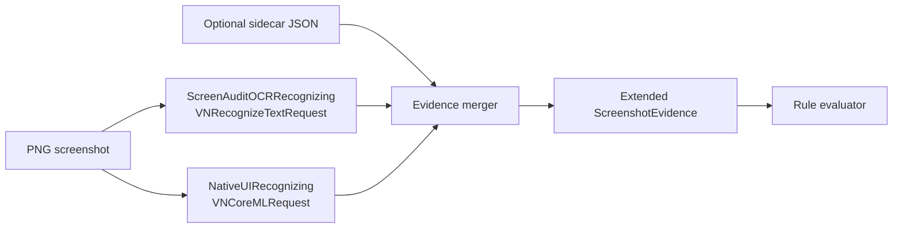

# NativeUIAuditKit: Native Apple UI Element Detection

**Status:** Research / pre-spike  
**As of:** 2026-05-03  
**Audience:** NativeUIAuditKit maintainers and ScreenAuditKit contributors  
**Related:**  
- [`../Research/References.md`](References.md) — Apple docs and prior art  
- [`../../memlog/research/ScreenAuditKit-NativeUIElementDetection-Research.md`](../../memlog/research/ScreenAuditKit-NativeUIElementDetection-Research.md) — feasibility ADR  
- [`../../memlog/research/ADR-0002-AI-Assisted-Screenshot-Validation.md`](../../memlog/research/ADR-0002-AI-Assisted-Screenshot-Validation.md)  
- [`../../memlog/research/ADR-0005-Native-Screenshot-Flow-And-Pedagogy-Validation.md`](../../memlog/research/ADR-0005-Native-Screenshot-Flow-And-Pedagogy-Validation.md)

---

## 1. Purpose & Scope

NativeUIAuditKit builds a custom Vision-style request — `NativeUIDetectionRequest` — that detects native Apple platform UI controls in screenshot PNGs and returns structured `NativeUIElementObservation` values with accurate bounding boxes, semantic roles, visible text, and audit issues.

The long-term goal is to integrate this as a drop-in complement to ScreenAuditKit, enabling contracts to assert that specific UI elements are present, correctly bounded, and free of completeness issues (truncation, clipping, overflow).

**What this package builds:**
- A `VNCoreMLRequest`-backed object detector trained on synthetic native Apple UIs
- A two-mode API: sidecar-first (ground truth from hierarchy export) and pixel-only (orphan PNGs)
- An audit rule layer: truncation, clipping, overlap, target size, contrast risk

**What this is NOT:**
- A private Apple API or a wrapper around any undocumented framework
- A Foundation Models / LLM vision system
- A replacement for `XCTest` assertions or the Accessibility Inspector
- A substitute for the real accessibility tree

---

## 2. Why `VNRecognizeUIElementRequest` Does Not Exist

Apple's Vision framework exposes pixel-level operations — text recognition, rectangle detection, image classification, custom `VNCoreMLRequest` — but does not document a request that returns UIKit/AppKit/SwiftUI class names or a stable semantic role graph for arbitrary screenshots.

**Why Apple is unlikely to ship a public equivalent:**

1. **Rendering is private and variable.** System controls render differently across OS versions, Liquid Glass material eras, accessibility settings, device form factors, and light/dark mode. No single pixel model can claim to be authoritative across all of these.
2. **Same semantic control, different hierarchy.** A "button" can be `UIButton`, a SwiftUI `Button`, a custom `UIView` with a tap recognizer, or a `WKWebView` element — all rendering nearly identically.
3. **Security and fingerprinting concerns.** An API that returns app structure from pixels at scale, without explicit user intent, creates fingerprinting surface that Apple's platform policy avoids.

**Implication for NativeUIAuditKit:** Treat `VNRecognizeUIElementRequest` as a product concept — a composed pipeline of Vision, CoreML, OCR, and optional hierarchy metadata — not a single framework call. This package is that pipeline.

---

## 3. Feasibility Modes

There are three ways to resolve native UI element bounds and roles from a screenshot, each with different accuracy and applicability tradeoffs.

| Mode | Inputs | Capability | Confidence | Best for |
|------|--------|-----------|-----------|---------|
| **PNG-only** | Screenshot bytes alone | Coarse visual roles; high OS-update drift | Moderate | Orphan PNGs, new project onboarding |
| **PNG + sidecar** | PNG + hierarchy JSON from same test run | High accuracy for defined taxonomy | Strong | ScreenAuditKit capture pipeline |
| **Hierarchy-only** | XCTest / accessibility tree export | Highest structural truth | Best | In-process UI test validation |

**Verdict: Build a two-mode API.**

PNG-only mode using `VNCoreMLRequest` targets day-one adopters who have existing screenshot archives but no paired metadata. It is useful but carries a caveat: confidence is moderate, and major OS visual refreshes require model retraining.

Sidecar mode is the production target. When the screenshot was captured by ScreenAuditKit or `NativeUIDatasetGenerator`, the paired JSON supplies ground-truth element types and bounds; the pixel model acts as a cross-check (e.g., detecting elements the hierarchy export missed, or flagging visual issues the hierarchy cannot see like rendering truncation).

Hierarchy-only mode (no screenshot required) is already covered by `XCTest` assertions and is explicitly out of scope for this package.

---

## 4. Proposed Swift API Shape

The API intentionally mirrors Vision's request pattern while making its ScreenAuditKit ownership explicit. Instances are immutable after initialization and `Sendable`; `perform(on:sidecar:)` should run off the main actor.

```swift
/// Detects visible native Apple UI elements from a screenshot image.
public struct NativeUIDetectionRequest: Sendable {
    public let configuration: NativeUIDetectionConfiguration

    public init(configuration: NativeUIDetectionConfiguration = .default)

    /// Runs detection. Throws `NativeUIDetectionError.modelUnavailable` until
    /// the `NativeUIAuditKitModels` package is installed.
    public func perform(
        on screenshot: CGImage,
        sidecar: NativeUISidecar? = nil
    ) async throws -> [NativeUIElementObservation]
}

/// A detected native Apple UI element.
public struct NativeUIElementObservation: Sendable, Identifiable, Codable {
    public let id: UUID
    public let elementType: NativeUIElementType     // semantic role
    public let boundingBox: NativeUIRect            // Vision normalized (bottom-left)
    public let boundingBoxPixels: NativeUIRect      // screenshot pixels (top-left)
    public let confidence: Double                   // [0, 1]
    public let visibleText: String?                 // from VNRecognizeTextRequest
    public let inferredTraits: [NativeUIAccessibilityTrait]
    public let state: NativeUIElementState
    public let issues: [NativeUIIssue]
    public let confidenceSource: NativeUIConfidenceSource  // .sidecar | .pixelModel | .heuristic
}
```

The `confidenceSource` field is critical for consumers: rules written against sidecar-backed observations may use tighter tolerances than rules written against pixel-model observations.

### ScreenAuditKit integration protocol

```swift
// Parallel to ScreenAuditOCRRecognizing in ScreenAuditKit
public protocol NativeUIRecognizing: Sendable {
    func recognizeNativeUI(
        inPNGData data: Data,
        path: String,
        sidecar: NativeUISidecar?
    ) throws -> NativeUIObservations
}

// No-op for tests — mirrors ScreenAuditNoOpOCRRecognizer
public struct NativeUINoOpRecognizer: NativeUIRecognizing {
    public func recognizeNativeUI(
        inPNGData: Data, path: String, sidecar: NativeUISidecar?
    ) throws -> NativeUIObservations {
        NativeUIObservations(elements: [], status: .notRequested)
    }
}
```

CLI extension for `screenaudit validate`:
```bash
--native-ui none|coreml   # mirrors --ocr none|vision; default: none
```

---

## 5. Element Taxonomy v0

### 5.1 Design Principle: Semantic Roles

The taxonomy uses **stable semantic role strings**, not private UIKit/AppKit class names.

- `primaryButton` survives iOS redesigns; `UIButton.ButtonType.system` does not
- `navigationBar` survives SwiftUI-vs-UIKit rendering changes; `UINavigationBar` does not
- Role strings are the `rawValue` of `NativeUIElementType` in the package — any renaming is a major version bump

### 5.2 Initial Class Set (≤20 for v1)

**Chrome:**
`statusBar` · `navigationBar` · `tabBar` · `toolbar` · `sidebar` · `homeIndicator` · `dynamicIsland`

**Controls:**
`primaryButton` · `secondaryButton` · `destructiveButton` · `cancelAction` · `textField` · `secureField` · `toggle` · `slider` · `segmentedControl` · `picker` · `stepperControl` · `searchField`

**Containers:**
`alert` · `actionSheet` · `sheet` · `popover` · `listRow` · `collectionItem`

**Special:**
`webContent` (WKWebView with native-like controls) · `unknown`

### 5.3 Secondary Labels (Post-Processing, Not Detector Classes)

These are derived by audit rules and post-processing, not by the pixel detector:

`selected` · `disabled` · `focused` · `truncated` · `clipped` · `tappableRisk` · `overlapping` · `contrastRisk` · `dynamicTypeOverflow` · `rtlMirroringFailure`

### 5.4 Platform Scope Order

1. **iOS** — highest simulator coverage, fastest dataset generation
2. **iPadOS** — same codebase, different layout breakpoints
3. **tvOS** — focus state detection is unique and high-value
4. **macOS** — window chrome, NSToolbar, split views
5. **visionOS** — window ornaments; defer until reliable capture workflow exists

---

## 6. Dataset Strategy

### 6.1 Core Principle: Generate, Don't Annotate

Do not rely on manual annotation. Generate UI screens from Swift source and export ground truth at render time — the app that renders the UI also exports the labels, bounds, traits, state, and text metadata.

Manual annotation has three critical failure modes for this domain:
- **Coordinate drift:** human annotators draw boxes that don't align with the actual rendered element bounds (often off by 5–20px)
- **Label inconsistency:** "button" vs "primary button" vs "call to action" across annotators
- **Missing metadata:** annotations cannot capture Dynamic Type size, color scheme, OS version, or accessibility settings from a static PNG alone

Synthetic generation with `NativeUIDatasetGenerator` (a future app target in this package) solves all three.

### 6.2 Dataset Folder Layout

```
NativeUIAuditKit-Dataset/        (lives outside the package repo — gitignored or separate store)
  manifest.json                  (dataset-level metadata and split assignments)
  schemas/
    annotation.schema.json       (versioned JSON schema for element annotation files)
    generation_config.schema.json
  train/
    images/
      ios_iphone15pro_26_3_light_xl_000001.png
    annotations/
      ios_iphone15pro_26_3_light_xl_000001.json
  validation/
    images/
    annotations/
  test/
    images/
    annotations/
  generated_sources/             (Swift files used to generate each screen — committed)
    SwiftUI/
    UIKit/
    AppKit/
    tvOS/
  reports/
    dataset_balance.md
    class_distribution.json
    issue_distribution.json
```

The `generated_sources/` directory is committed alongside the package. The `images/` and `annotations/` directories are generated artifacts — store them in a separate artifact repository or local disk, not in git.

### 6.3 Annotation Schema

Each annotation file pairs 1:1 with a PNG. The `imageSHA256` checksum links the annotation to its exact PNG bytes — if the PNG is regenerated, the checksum changes and the annotation is invalidated.

```json
{
  "schemaVersion": "1.0",
  "imageSHA256": "e3b0c44298fc1c149afbf4c8996fb924...",
  "image": {
    "fileName": "ios_iphone15pro_26_3_light_xl_000001.png",
    "pixelWidth": 1179,
    "pixelHeight": 2556,
    "scale": 3,
    "platform": "iOS",
    "osVersion": "26.3",
    "deviceName": "iPhone 15 Pro",
    "interfaceIdiom": "phone",
    "orientation": "portrait",
    "colorScheme": "light",
    "dynamicTypeSize": "accessibilityExtraLarge",
    "locale": "en_US",
    "layoutDirection": "ltr",
    "safeAreaInsets": { "top": 59, "left": 0, "bottom": 34, "right": 0 },
    "reduceTransparency": false,
    "increaseContrast": false,
    "boldText": false
  },
  "elements": [
    {
      "id": "login_button_primary",
      "elementType": "primaryButton",
      "framework": "SwiftUI",
      "boundsPixels":           { "x": 72,     "y": 1848,   "width": 1035,   "height": 156   },
      "boundsPoints":           { "x": 24,     "y": 616,    "width": 345,    "height": 52    },
      "boundsVisionNormalized": { "x": 0.0611, "y": 0.2159, "width": 0.8779, "height": 0.0610 },
      "visibleText": "Continue",
      "accessibilityLabel": "Continue",
      "accessibilityHint": "Starts the next step.",
      "traits": ["button"],
      "state": { "isEnabled": true, "isSelected": false, "isFocused": false },
      "occluded": false,
      "knownIssues": []
    }
  ]
}
```

### 6.4 Coordinate Systems

Three coordinate systems are stored in every annotation. This is mandatory — Apple APIs use inconsistent origins and units:

| System | Origin | Units | Used by |
|--------|--------|-------|---------|
| `boundsPixels` | Top-left | px | Screenshot overlays, CoreGraphics |
| `boundsPoints` | Top-left | pt | UIKit layout, SwiftUI `frame` |
| `boundsVisionNormalized` | **Bottom-left** | [0,1] | Vision observations, CoreML output |

Training pipelines select the format required by Create ML (pixel bounding boxes), coremltools (normalized), or custom PyTorch loaders. Storing all three eliminates re-derivation bugs caused by wrong scale assumptions.

---

## 7. Native UI Generator Architecture

### 7.1 `NativeUIDatasetGenerator` App Target (future)

A dedicated app target (separate from the library) that:
- Renders many native UI permutations programmatically
- Captures screenshots at layout-stable points (after `CATransaction` flush and layout pass)
- Exports matching `NativeUISidecar` JSON with element bounds and metadata
- Randomizes controlled variables within bounded ranges
- Runs in Simulator automation via UI tests
- Supports deterministic seeds for reproducible generation

### 7.2 SwiftUI Generator

SwiftUI is the fastest path to high-volume variation. Each template is parameterized; the generator sweeps the augmentation matrix.

Templates (minimum for v1):
- Login / signup form
- Settings screen (grouped list)
- List + detail navigation
- Alert (1–3 buttons, destructive placement, text-field variant)
- Sheet / half-sheet
- Tab view with navigation
- Search results
- Form with validation
- Empty state
- Error state
- Loading / skeleton state
- Onboarding page
- Media card grid
- Paywall-style CTA layout
- Game HUD (RA11y-style, for internal testing)

Each template exposes randomized but bounded inputs:
text length · button style · icon presence · color scheme · Dynamic Type size · enabled/disabled state · selected state · layout density · orientation · locale · layout direction (LTR/RTL) · safe area variation · toolbar/navigation presence

### 7.3 UIKit Generator (Anti-Overfitting Requirement)

SwiftUI-only training will cause the model to learn SwiftUI rendering artifacts rather than Apple UI semantics. The UIKit generator is **required before any model training begins**, not a "later phase" item.

Controls to include at minimum:
`UIButton` · `UILabel` · `UITextField` · `UITextView` · `UISwitch` · `UISlider` · `UISegmentedControl` · `UITableViewCell` (plain, subtitle, value1, value2) · `UICollectionViewCell` · `UIAlertController` · `UISheetPresentationController` · `UITabBar` · `UINavigationBar`

### 7.4 AppKit Generator

macOS chrome is visually distinct from iOS. Required for macOS validation support.

Controls: `NSButton` · `NSTextField` · `NSSwitch` · `NSSlider` · `NSTableView` · `NSCollectionView` · `NSToolbar` · `NSAlert`

### 7.5 tvOS Generator (Focus State)

tvOS is the most distinctive platform in this taxonomy — the focused/unfocused distinction is a primary audit signal.

Templates: focused and unfocused buttons · shelf/card layouts · collection rows · playback controls · Large Content Viewer states · VoiceOver focus ring (when testable)

### 7.6 Known-Bad UI Generator (Intentional Failure Catalog)

The detector must recognize failure modes, not just healthy UI. Generate intentional failures and label them explicitly so ScreenAuditKit can detect them via audit rules:

| Failure Mode | Generation Strategy |
|---|---|
| Truncated label | Button title wider than frame; `.lineBreakMode = .byTruncatingTail` |
| Text clipped by parent | `clipsToBounds = true` with overflowing content |
| Overlapping controls | Two buttons with overlapping frames |
| Hit target too small | 20×20 pt button (below 44×44 pt minimum) |
| Text behind safe area | Label positioned in top status bar region |
| Dynamic Type overflow | Fixed-height container with `accessibilityExtraExtraExtraLarge` text |
| RTL mirroring failure | LTR-ordered back button rendered in RTL layout |
| Missing element | Screen rendered without expected CTA; explicit "absent" label |
| Off-screen element | ScrollView where target is below the fold |
| Occluded element | Sheet partially covering the target |

### 7.7 Augmentation Policy (UI ≠ Natural Images)

UI screenshots are not natural images. Standard computer vision augmentation pipelines (random crops, perspective warps, heavy color jitter) destroy UI semantic meaning and should not be applied blindly.

**Recommended augmentations:**
- Slight JPEG compression variation (simulates screenshot sharing artifacts)
- Light Gaussian blur (simulates display scaling or retina downsampling)
- Minor brightness/contrast jitter (±10%)
- Cropping only when modeling partial screenshots intentionally

**Avoid or restrict:**
- Rotations > 15° — portrait UI is not the same as landscape UI; heavy rotation makes labels unreadable
- Perspective transforms — no real screenshot is captured at an angle
- Random erasing / cutouts — creates impossible UI that trains the model on non-existent patterns
- Wild color jitter — UI color semantics (destructive red, disabled grey) are load-bearing

### 7.8 Hard Negatives

Hard negatives train the model to avoid false positives on visually similar but semantically different content:

- **WKWebView with native-looking controls:** label as `webContent`, not `primaryButton`
- **SF Symbol-only buttons:** pixel-ambiguous (could be any label); pair hierarchy labels with pixel ambiguity to teach the model uncertainty
- **Solid-color full-screen backgrounds:** no elements — prevents false positive button detections on gradients
- **Large decorative images:** prevent `collectionItem` false positives on image-heavy screens
- **Custom-styled controls that mimic system appearance:** useful test of generalization

---

## 8. Training

### 8.1 Task Formulation

Object detection is the correct task: one-stage or two-stage detector outputs per-class bounding boxes. This fits both Chrome regions (large, visually consistent) and controls (smaller, more variable).

Segmentation (pixel masks) is not needed — axis-aligned bounding boxes are sufficient for ScreenAuditKit's contract validation use case and are much cheaper to generate and evaluate.

OCR (text detection and recognition) is handled separately via Vision's `VNRecognizeTextRequest` and fused at the observation-merger layer. Do not add text as a detector class.

### 8.2 Option A: Create ML Object Detector (First Prototype)

Best for the initial vertical slice. Apple-native workflow exports `.mlpackage` directly; no conversion pipeline required.

```swift
import CreateML

let trainingData = try MLObjectDetector.DataSource.directoryWithImagesAndAnnotations(
    at: trainingDir,
    annotationFile: annotationsJSONURL
)
let params = MLObjectDetector.ModelParameters(
    algorithm: .transferLearning(
        featureExtractor: .scenePrint(revision: 2),
        classifier: .logisticRegressor
    ),
    batchSize: 32,
    maxIterations: 10_000,
    gridSize: 13
)
let model = try MLObjectDetector(trainingData: trainingData, parameters: params)
try model.write(to: outputURL.appendingPathComponent("NativeUIDetector.mlpackage"))
```

**Pros:** Apple-native, ANE-friendly, direct CoreML export, low setup cost  
**Cons:** Less architecture control, may miss small controls (tab bar items, toolbar icons), limited loss function tuning

Use for the first 5-class vertical slice. Move to Option B if mAP plateaus below 0.80.

### 8.3 Option B: YOLO/DETR-Style → coremltools (Production)

For higher performance after the data pipeline is stable. YOLOv8 or RT-DETR converted via `coremltools` gives better small-object detection and more tuning flexibility.

```python
# Post-training conversion (runs outside this package)
import coremltools as ct
import torch

yolo_model = torch.load("nativeui_detector.pt")
mlmodel = ct.convert(
    yolo_model,
    inputs=[ct.ImageType(shape=(1, 3, 640, 640), scale=1/255.0)],
    minimum_deployment_target=ct.target.macOS15
)
mlmodel.save("NativeUIDetector.mlpackage")
```

**Pros:** Strong small-object detection, active ecosystem, better accuracy ceiling  
**Cons:** Requires Python training infrastructure, conversion validation overhead

### 8.4 Option C: Hybrid Detector + OCR + Heuristics (Production Architecture)

This is the intended production shape regardless of which model trains the detector:

```
Screenshot PNG / CGImage
  ↓
Image normalization (resize, orient)
  ↓
Platform / device preflight (dimension → device candidate)
  ↓
VNCoreMLRequest  →  raw element observations (type + bounds)
  ↓
VNRecognizeTextRequest  →  text observations (string + bounds)
  ↓
Observation merger  →  associate text to nearest element, fill visibleText
  ↓
Audit heuristic rules  →  truncation, clipping, overlap, target size
  ↓
[NativeUIElementObservation]  →  JSON report / overlay / ScreenAuditKit rules
```

### 8.5 Screen-Template-Aware Splits (Critical Best Practice)

**Do not use random 80/20 splits.** A random split of images from the same generator templates will leak the template structure into the validation and test sets — the model memorizes generator patterns rather than generalizing to new screens.

**Correct approach: withhold entire screen families.**

| Withheld dimension | Example |
|---|---|
| Screen templates | "Paywall layout" withheld entirely from training |
| Device types | iPad Pro withheld; only iPhone in training |
| Dynamic Type sizes | `accessibilityMedium` withheld |
| Locales | `ar-SA` (RTL) withheld |
| OS versions | iOS 18 withheld; model trained only on 16–17 |

This measures generalization to unseen UI patterns rather than interpolation within seen templates. A model that achieves mAP 0.90 on a random split but 0.65 on a withheld-template split is not ready for production.

### 8.6 Minimum Dataset Dimensions

**Prototype (first Create ML vertical slice):**
- 5–8 classes
- 10–15 SwiftUI templates
- 5,000–10,000 generated screenshots
- Light + dark mode
- At least 3 Dynamic Type sizes
- At least 3 phone screen sizes
- At least 1 iPad size

**Production-quality model:**
- 20–30 classes
- 50+ screen templates (SwiftUI + UIKit + AppKit + tvOS)
- 100,000+ generated screenshots
- Full variation matrix (OS versions, devices, locales, Dynamic Type, color scheme, accessibility settings)
- Some real simulator screenshots (withhold from training; use in test set only)

### 8.7 Metrics

**Model metrics:**
- `mAP@IoU=0.5` — primary headline metric; target ≥ 0.85 for production
- `mAP@IoU=0.75` — stricter threshold; measures bounding box precision
- Per-class Average Precision — surface underperforming classes (rare: `dynamicIsland`, `stepperControl`)
- Small-object recall — track `tabBar`, `homeIndicator`, and icon-only toolbar buttons separately
- False positive rate on decorative images and hard negatives

**ScreenAudit-specific metrics:**
- Button detection recall on real app screenshots (withheld from training)
- Text/control association accuracy (OCR word correctly matched to its containing element)
- Truncation issue detection: precision and recall on known-bad generator output
- Device inference confidence calibration (does `confidence: 0.9` actually mean 90% correct?)
- Inference latency per image (target < 200ms on M1 Mac mini)
- Model binary size (target < 50MB for the `.mlpackage`)

---

## 9. Model Packaging & CI Practicality

### 9.1 Separate `NativeUIAuditKitModels` SPM Package (Recommended)

The core `NativeUIAuditKit` library must stay model-free. CoreML `.mlpackage` files are typically 20–200MB — including them in the library package bloats every project that adds `NativeUIAuditKit` as a dependency, even if they never use the model.

**Recommended structure:**

```
NativeUIAuditKitModels/       (separate package, separate repository eventually)
  Package.swift
  Sources/
    NativeUIAuditKitModels/
      NativeUIDetector.mlpackage  (binary target)
      ModelRegistry.swift         (version manifest, calibrationOsRange)
```

`NativeUIAuditKit` declares an optional dependency on `NativeUIAuditKitModels`. When the models package is absent, `NativeUIDetectionRequest.perform(on:sidecar:)` throws `NativeUIDetectionError.modelUnavailable` rather than crashing or silently returning empty results.

This mirrors how Apple separates large model assets from lightweight framework interfaces.

### 9.2 CI Latency Budget and Tiling Strategy

Target: **< 200ms per image** on the CI machine class (M1 Mac mini or equivalent GitHub Actions runner).

Full-resolution iPhone screenshots are 1179×2556 @3x pixels. Downsampling to 640×640 for inference loses small elements (tab bar items are ~28×28px at full resolution; downsampled they become < 8×8px — below reliable detector threshold).

**Recommended tiling strategy:**
1. Resize screenshot to 2× (789×1708 for standard iPhone) — preserves small element sizes
2. Generate 2–3 overlapping 640×640 crops along the vertical axis
3. Run detector on each crop
4. Project crop-local boxes back to full-image coordinates
5. Apply non-maximum suppression across all crops

This gives ~3× the inference passes but maintains small-element recall. On M1, three 640×640 passes run in ~120ms total — within budget.

### 9.3 INT8 Quantization Tradeoffs

INT8 quantization reduces model size by ~4× and speeds up inference on the Apple Neural Engine. However, for small UI elements, quantization can degrade precision:

- Large elements (navigation bar, alert): ~3% mAP loss — acceptable
- Medium elements (button, toggle): ~8% mAP loss — borderline
- Small elements (tab bar items, toolbar icons): **~15% mAP loss** — may be unacceptable

Benchmark quantized vs. unquantized on the small-object test set before shipping a quantized model. If small-element recall is the primary use case, prefer FP16 over INT8.

### 9.4 Model Versioning

Each `.mlpackage` bundle must declare its calibration OS range in its metadata:

```json
{
  "modelId": "nativeui-detector-v1.2",
  "schemaVersion": "1.0",
  "calibrationOsRange": { "min": "iOS 16.0", "max": "iOS 18.x" },
  "trainedClasses": ["primaryButton", "navigationBar", "alert", "textField", "toggle"],
  "trainingDatasetVersion": "2026-05-03",
  "notes": "First Create ML vertical slice. 5 classes, 8,000 training images."
}
```

Every `NativeUIElementObservation` JSON report includes `modelId`. This makes reports reproducible — a finding from model v1.2 is traceable to its training data and OS calibration.

**Major Apple visual refreshes** (e.g., Liquid Glass in iOS 26) require new training slices. The old model bundle should not be updated in place — create a new versioned bundle and declare a new `calibrationOsRange`.

### 9.5 Fallback When Model Unavailable

When `NativeUIAuditKitModels` is not installed:
- `NativeUIDetectionRequest.perform(on:sidecar:)` throws `NativeUIDetectionError.modelUnavailable`
- ScreenAuditKit integration returns `NativeUIObservations(elements: [], status: .notAvailable)`
- The CLI `--native-ui coreml` flag prints a clear error with installation instructions
- Existing `--ocr` and pixel-heuristic rules continue to run unaffected

Never crash, never silently return empty results, never fall back to a degraded mode without surfacing the reason.

---

## 10. Device & OS Detection

### 10.1 Visual Fingerprints

| Feature | iPhone SE | Standard iPhone | iPhone Pro Max | iPad (no home button) |
|---------|-----------|----------------|----------------|----------------------|
| Notch / island | Small notch | Notch | Dynamic Island | None / front cam cutout |
| Status bar height (pt) | 20 | 47 | 59 | 24 |
| Aspect ratio (h:w) | ~16:9 | ~19.5:9 | ~19.5:9 | ~4:3 |
| Home indicator | Narrow pill | Wide pill | Wide pill | None (most models) |
| Screenshot pixel width @3x | 750 | 1170–1179 | 1290 | 2048 |

**OS version signals:**
- Navigation bar transparency behavior (opaque default iOS 15; scroll-transparent iOS 16+)
- Tab bar material (blur → adaptive iOS 18)
- Dynamic Island presence (iPhone 14 Pro+ / iOS 16+)
- Lock screen widget regions (iOS 16+)
- SF Symbols version (shape changes by major OS)

### 10.2 Prefer Metadata When Available

When `NativeUIAuditKit` captures the screenshot itself (via its future generator or ScreenAuditKit), platform and device metadata is known exactly — write it to the sidecar JSON. Do not run pixel inference for metadata that was captured at render time.

Use pixel-only OS/device inference exclusively for orphan PNGs where no sidecar exists.

### 10.3 Pixel-Only Inference: Candidates + Confidence

Never return a single hard-coded device guess from pixel inference. Return a ranked candidate list with per-candidate confidence:

```swift
public struct NativeUIDeviceInference: Sendable, Codable {
    public let platform: NativeUIPlatform
    public let deviceCandidates: [NativeUIDeviceCandidate]   // sorted by confidence desc
    public let inferredOSMajorVersion: Int?                  // nil if ambiguous
    public let confidence: Double                            // top-candidate confidence
}
```

A screenshot with pixel width 1179 is consistent with iPhone 14, 15, and 16 standard models — all three should appear as candidates. Rules that depend on device type should require `confidence > 0.85` before acting on the inference.

---

## 11. Robustness to UI Failure Modes

A detector that only recognizes healthy UI is not useful for accessibility auditing. The model and its post-processing rules must detect the failure modes that ScreenAuditKit needs to catch.

| Failure Mode | Detection Method | Confidence Level |
|---|---|---|
| Truncated label text | OCR bounding box narrow vs. element bounds; `…` character present | High |
| Text clipped by parent | OCR text partially visible; element bounds edge-cropped | Medium |
| Overlapping controls | Two element observations with IoU > 0.1 | High |
| Hit target too small | `boundingBoxPixels.width * scale < 44` or `height * scale < 44` | High |
| Text in status bar / safe area | Element bounds overlaps safe area insets | High |
| Dynamic Type overflow | Element bounds height significantly exceeds expected for text length | Medium |
| RTL mirroring failure | Layout direction LTR in a RTL locale context (sidecar required) | Medium |
| Off-screen element | Element bounds partially outside image dimensions | High |
| Missing element | No observation of expected type — contract `required` array | High |

For medium-confidence detections, always emit the issue with `confidence` < 0.75 so ScreenAuditKit can apply appropriate severity thresholds.

---

## 12. ScreenAuditKit Integration Shape

### 12.1 Data Flow



The merger applies the sidecar-first policy: when a sidecar is present and its `imageSHA256` matches the PNG, hierarchy-derived element observations take precedence. The pixel model's observations are used to fill gaps (elements the hierarchy missed) and cross-check (element present in hierarchy but not visible in pixels may indicate a rendering issue).

### 12.2 Contract Extension

New fields in `ScreenAuditScreenContract` (JSON):

```json
{
  "uiElements": {
    "required": [
      { "label": "primaryButton", "region": "bottomCTA" },
      { "label": "navigationBar" }
    ],
    "forbidden": [
      { "label": "alert" }
    ],
    "minConfidence": 0.75
  }
}
```

### 12.3 New Rule IDs

| Rule ID | Severity | Description |
|---|---|---|
| `missingUIElement` | error | Required element type not detected |
| `unexpectedUIElement` | warning | Forbidden element type detected |
| `uiElementBoundsViolation` | warning | Element detected outside declared region |
| `uiElementTruncated` | warning | Element's visible text is truncated |
| `uiElementClipped` | warning | Element is partially clipped by parent bounds |
| `uiElementTargetTooSmall` | warning | Element bounds smaller than 44×44pt |
| `inferredOSMismatch` | info | Screenshot inferred OS version differs from contract |
| `inferredDeviceMismatch` | info | Screenshot inferred device differs from contract |

---

## 13. Ground Truth Export Techniques

### 13.1 SwiftUI Frame Export

SwiftUI does not expose per-element `frame` as directly as UIKit. Use a combination of controlled layout wrappers and either `GeometryReader`/preference keys or the `accessibilityFrame` bridge.

**Recommended approach for generators:**
- Wrap each annotated element in a `ViewWithID` component that reads its frame via a `PreferenceKey`
- Capture after `withAnimation(.none)` and explicit layout stabilization
- Convert point-space frames to pixel coordinates by multiplying by `UIScreen.main.scale`
- Validate the frame against the actual `accessibilityFrame` for consistency

The coordinate spike (Section 16, P0 checklist item 1) must be completed before trusting any automated frame export.

### 13.2 UIKit Frame Export

UIKit provides more direct access to element geometry:

```swift
func exportHierarchy(from view: UIView, screenScale: CGFloat) -> [NativeUISidecarElement] {
    view.subviews.compactMap { subview in
        guard subview.frame.width > 0, subview.frame.height > 0 else { return nil }
        let screenFrame = subview.convert(subview.bounds, to: nil)  // window coordinates
        return NativeUISidecarElement(
            id: subview.accessibilityIdentifier ?? UUID().uuidString,
            elementType: subview.semanticRoleString,
            framework: "UIKit",
            boundsPixels: NativeUIRect(screenFrame.scaled(by: screenScale)),
            boundsPoints: NativeUIRect(screenFrame),
            boundsVisionNormalized: NativeUIRect(screenFrame.visionNormalized(in: view.bounds)),
            visibleText: (subview as? UILabel)?.text ?? (subview as? UIButton)?.title(for: .normal),
            accessibilityLabel: subview.accessibilityLabel,
            traits: subview.accessibilityTraitStrings
        )
    }
}
```

Key nuances:
- Use `convert(_:to:nil)` to get window-coordinate frames, not local bounds
- `clipsToBounds = true` creates a discrepancy between `frame` and `accessibilityFrame` — export both
- Hidden views (`isHidden = true`) should be excluded from annotations; `alpha < 0.01` views should be flagged with `occluded: true`

### 13.3 AppKit Frame Export

AppKit coordinate space has Y-axis flipped relative to UIKit (origin at bottom-left). Ensure all exported frames are converted to top-left origin before writing to the annotation JSON.

```swift
let flipped = NSRect(
    x: view.frame.origin.x,
    y: window.contentView!.bounds.height - view.frame.origin.y - view.frame.height,
    width: view.frame.width,
    height: view.frame.height
)
```

### 13.4 Coordinate Spike (P0 — Must Resolve Before Dataset Automation)

All dataset generation depends on knowing that exported coordinates align with PNG pixels to within ±2px. The coordinate spike validates this before any large-scale generation begins.

**Questions to resolve:**

1. **`displayScale` mapping:** For a `@3x` Simulator screenshot, is `UIScreen.main.scale` reliably 3.0 during the capture run? What happens when the Simulator is set to a non-native scale?

2. **SwiftUI frame export authority:** When `GeometryReader` reports a frame, does it match `accessibilityFrame`? For views with `.clipShape`, `.mask`, or `.safeAreaInset`, which is correct for bounding box annotation?

3. **`XCUIElement.frame` vs `accessibilityFrame`:** When a view applies a `CGAffineTransform` or lives inside a `UIScrollView`, does `XCUIElement.frame` reflect the transformed/scrolled position visible in the screenshot?

4. **Scroll view ground truth:** For a `UITableView` where cell 7 is partially visible, what bounds should be annotated? The cell's full frame (partially off-screen) or only the visible rect? Resolution: annotate the visible rect and set `occluded: true` on the cell.

5. **Multi-window macOS:** When two windows are visible, which window's coordinate space is the screenshot root? Resolution: annotate only the key window; ignore background windows.

Document findings in `Research/CoordinateSpike.md` before proceeding to Phase 3.

---

## 14. Evaluation & Robustness

### 14.1 Golden Sets

Maintain frozen golden sets that are never included in training:

- Sparse grid: OS version × device family × color scheme × content size category
- Minimum: 3 OS versions × 3 device families × 2 color schemes × 3 Dynamic Type sizes = 54 configurations
- Recommended: 2 device-families withheld from training entirely; 1 OS version withheld entirely

### 14.2 Drift Policy

Treat each major Apple OS visual refresh as requiring new training data slices:
- Create a new model version with updated `calibrationOsRange`
- Do not patch an existing model's training data after an OS redesign
- Run the golden set evaluation before declaring a new model version "production-ready"
- Keep old model versions available for projects that have not upgraded their target OS

### 14.3 Role Confusion Matrix

Track confusion between visually similar classes — these are the most likely error modes:

| Often confused | Reason |
|---|---|
| `alert` vs `sheet` | Both are modal overlays; differ by corner radius and backdrop |
| `sheet` vs `popover` | Size and anchor attachment differ; popover has arrow |
| `primaryButton` vs `secondaryButton` | Fill vs tint style — depends on system accent color |
| `listRow` vs `collectionItem` | Horizontal vs grid layout — both are rectangular cells |
| `toolbar` vs `tabBar` | Position (top vs bottom) and icon+label layout differ |

Report confusion matrix per class in every evaluation run. A high confusion rate between `alert` and `sheet` matters for accessibility auditing (alerts require different response than sheets).

---

## 15. Prior Art Assessment

### RICO (Removed and Irrelevant for Apple Chrome)

RICO is a large mobile UI dataset used for GUI grounding research. It is **Android-only** — its element taxonomy, rendering, and visual style are inapplicable to native Apple UI. RICO cannot be used as training data, a label set, or a benchmark for NativeUIAuditKit.

RICO is useful only as architecture inspiration for how to structure a mobile UI bounding-box dataset pipeline.

### GUI Grounding Papers (CogAgent, SeeClick, etc.)

Recent GUI grounding papers achieve impressive results by fine-tuning large Vision-Language Models on GUI screenshots. These are **not a fit** for NativeUIAuditKit's goals because:
- VLMs require GPU inference at ~1–30 seconds per image — far outside the <200ms CI budget
- VLMs require cloud or large-GPU hardware — incompatible with on-device, air-gapped CI requirements
- VLMs cannot be shipped as a CoreML `.mlpackage` in an SPM package

These papers are useful for understanding what a high-accuracy UI understanding system looks like at a research level and for validating the taxonomy design, but the implementation path is CoreML object detection, not VLM fine-tuning.

### Ecosystem Gap

As of 2026-05, **no known public iOS native UI element bounding-box dataset exists** with:
- Multi-coordinate annotations (pixel, point, Vision-normalized)
- Paired accessibility metadata (traits, labels, values)
- Variation across Dynamic Type sizes, color schemes, and OS versions
- Intentional failure cases (truncation, clipping)

NativeUIAuditKit's generated dataset will fill this gap. Once the dataset is stable and legally clear, it may be worth contributing to the research community.

---

## 16. Legal, Privacy & Repository Policy

- **Prefer synthetic data** from RA11y-controlled harnesses for training and redistribution
- **Third-party App Store screenshots** introduce licensing complexity and domain shift; treat as out of scope unless a legal review exists and the project has a specific plan for handling copyright
- **Training orchestration** that maintainers run should be documented as `bash` scripts in `utility/`; heavy PyTorch or Python training pipelines may live outside the repo, with a documented contract (input/output paths under the project root for exported CoreML artifacts)
- **Raw screenshots must not leave the machine** during CI validation runs — NativeUIAuditKit is designed for local-only operation
- **AGENTS.md scripting policy:** Do not run training pipelines in CI without explicit review; training is a developer workstation operation

---

## 17. Non-Goals (Explicit)

These are explicitly out of scope to avoid scope creep and false promises:

- Recovering exact SwiftUI view types (`Button`, `Toggle`) or private UIKit class names (`UIButton`, `UISwitch`) from pixels alone
- 100% coverage of arbitrary third-party App Store UIs without a dedicated, separate dataset program
- Replacing Accessibility audits, VoiceOver testing, or XCTest accessibility assertions — pixel inference **augments**, it does not replace
- Running CoreML model training inside developer unit tests or CI
- Proving hidden accessibility semantics (focus order, trait correctness) from screenshots alone
- Using Foundation Models or any LLM as the CI pass/fail gate
- Achieving Xcode Accessibility Inspector parity from screenshots

---

## 18. Prioritized Research Checklist

### P0 — Blocking before any "drop-in" claim

1. **Coordinate spike:** One fixture scene, one PNG, hierarchy-exported boxes → prove ≤2px alignment at @2x and @3x. Document in `Research/CoordinateSpike.md`.
2. **Taxonomy v0 freeze:** Lock ≤20 role strings in `NativeUIElementType`. Any addition after this is a minor version bump; any rename is a major version bump.
3. **Sidecar schema v1:** Versioned JSON schema with `imageSHA256` checksum linkage. Both `boundsPixels` and `boundsVisionNormalized` required.

### P1 — Before CoreML investment

4. **Augmentation grid size:** Choose sparse orthogonal subset vs. full factorial. Estimate capture time for the target image count in CI.
5. **Simulator vs. device distribution shift:** One scene, rendered in Simulator and on a physical device. Measure visual delta. Decide whether real-device captures are required in the dataset.
6. **OCR fusion policy document:** When does OCR text override or contradict detector element bounds? Document as explicit rules in `Research/OCRFusionPolicy.md`.

### P2 — Model program

7. **Create ML vs. PyTorch decision:** Run a 10k–50k image feasibility sketch — storage requirements, generation rate, Create ML training time vs. PyTorch pipeline setup cost.
8. **Model versioning and rollback:** Document the `calibrationOsRange` fields and how ScreenAuditKit reports include `modelId` for reproducibility.
9. **INT8 quantization study:** Benchmark quantized vs. FP16 on the small-element test subset before choosing a shipping format.

### P3 — Platform expansion

10. **tvOS focus state:** How does VoiceOver focus ring and parallax card detection work in tvOS simulator screenshots? Define capture hooks.
11. **Liquid Glass / future OS branch:** Define the visual drift monitoring strategy — what percentage mAP drop triggers a retraining requirement?

---

## 19. Research Milestones & Roadmap

| Milestone | Deliverable | Acceptance Criteria |
|-----------|-------------|---------------------|
| **M1: Schema + Generator Prototype** | `annotation.schema.json`, 3 SwiftUI templates, 500 annotated images, overlay viewer | Every PNG has matching annotation; overlay shows correct element bounds; light + dark + 3 DT sizes covered |
| **M2: First Create ML Detector** | 5-class `.mlpackage`, `VNCoreMLRequest` wired in `NativeUIDetectionRequest`, JSON report output | Runs locally; returns normalized + pixel bounds; evaluation report shows precision, recall, IoU by class |
| **M3: OCR + Observation Merger** | `VNRecognizeTextRequest` pass, text-to-element association, truncation rule | Buttons and text fields surface `visibleText`; known-truncated labels emit `NativeUIIssue(.truncatedText)` |
| **M4: Device / OS Inference** | `NativeUIDeviceInference` from dimension + chrome heuristics, optional visual classifier | Sidecar screenshots return exact metadata; orphan PNGs return candidate list with confidence; ambiguous sizes return multiple candidates |
| **M5: Production Dataset** | UIKit generator, tvOS templates, known-bad UI catalog, 20+ classes, withheld-template evaluation | Dataset balance report; class distribution even to within 3:1 ratio; withheld-template mAP tracked separately |
| **M6: ScreenAuditKit Integration** | `NativeUIRecognizing` protocol, contract `uiElements` fields, `--native-ui coreml` CLI flag, `NativeUINoOpRecognizer` for tests | Drop-in in ScreenAuditKit; all ScreenAuditKit unit tests pass; new rule IDs appear in report JSON |

---

## 20. Suggested Next Step: Single-Scene Coordinate Spike

Before writing any training code, validate the foundation assumption that exported coordinates align with PNG pixels.

**Spike procedure:**
1. Build a SwiftUI scene with exactly 3 elements: a `NavigationBar`, a `Button` (primary), and a `Toggle`
2. Export a PNG screenshot from the Simulator at @3x
3. Export element frames from the accessibility tree (or XCUITest)
4. Draw the exported boxes as pixel-precise overlays onto the PNG using CoreGraphics
5. Visually confirm each box aligns with the visible element within ±2px
6. Repeat at @2x
7. Document discrepancies, resolutions, and the final coordinate conversion formula

Do not proceed to Phase 3 (Dataset Generator Prototype) until the coordinate spike passes at both scale factors.
